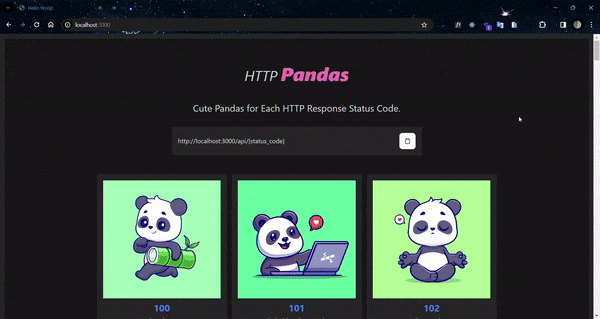

<h1 align="center">
  HTTP Duck 🦆
</h1>

<div align="center">
   <a href="https://github.com/JohnPetros">
      
   </a>
   
   <a href="https://github.com/JohnPetros/http-pandas/commits/main">
      
   </a>
  </a>
   </a>
   <a href="https://github.com/JohnPetros/http-pandas/blob/main/LICENSE.md">
      
   </a>
    
</div>
<br>

## 🖥️ About the project

HTTP Pandas is a collection of cute and funny panda images that more-or-less represent various HTTP status codes, inspired by the likes of [HTTP Cats](https://http.cat/) and [HTTP Dogs](https://httpstatusdogs.com/).

To use it simply Embed an image using the base URL https://http-pandas/api/{status_code} and replace {status_code} with an HTTP status code.

the goal of developing this project was learn the basic but amazing features of [Bun](https://bun.sh/), a fast JavaScript runtime, package manager, bundler, test runner etc etc... And [Elysia](https://elysiajs.com/), a ergonomic framework to build a server.

### ⏹️ Demonstration

<table align="center">
  <tr>
    <td align="center" width="1000">
    
    </td>
  </tr>
</table>

---

## ✨ Features

### ✅ Functional Features

#### Image Processing

- [x] Should process the panda image before return it to client
- [x] The processing should:
  - resize
  - add border
  - add text
  - convert to buffer

#### Http Panda

- [x] Should return panda for each http status code provided
- [x] Each panda should have image, http status code and http status description

#### Website

- [x] Should provide a website about the project
- [x] Should display all available pandas on website
- [x] Should intruduce the user on the usage of the project

---

## ⚙️ Architecture

## 🛠️ Technologies and tools

This project was developed using the following technologies:

- **[Bun](https://bun.sh/)** as runtime, package manager and bundler

- **[Elysia](https://elysiajs.com/)** as server

- **[Sharp](https://sharp.pixelplumbing.com/)** as image processor

- **[Zod](https://zod.dev/)** as data schema validator

- **[HTMX](https://htmx.org/)** to access the server side features directly in [HTML](https://developer.mozilla.org/pt-BR/docs/Web/HTML)

- **[TailwindCSS](https://tailwindcss.com/)** to style the website

- **[Preline UI](https://preline.co/)** to build accessible components with TailwindCSS

> For more details about the project's dependencies like specifi versions of each dependency, se [package.json](https://github.com/JohnPetros/http-pandas/blob/main/package.json)

---

## 🚀 How to run the application?

### 🔧 Prerequisites

Before download the prject you will need install some tools:

- [Git](https://git-scm.com/)
- [Bun](https://nodejs.org/en)

> Besides that, it is good to have some tool to write the code like [VSCode](https://code.visualstudio.com/)

> Also it is pivotal setting the environment variables on the `.env` file before running the application. See the [.env.example](https://github.com/JohnPetros/http-pandas/blob/main/.env.example) file to know which variables should be set

### 📟 Running the aplication

```bash

# Clone este repositório
$ git clone https://github.com/JohnPetros/http-pandas.git .

# Install the dependencies
$ bun install

# Run the application on a development environment
$ bun dev

```

> Probably the aplication will be running on http://localhost:3000

---

## 🚚 Deploy

This application's deploy was made using **[Render plataform](https://dashboard.render.com/)**, which means you can use the running application accessing **[link](https://http-pandas.onrender.com/)**.

---

## 🤝 how to Contribute

```bash

# Fork this repo
$ git clone https://github.com/JohnPetros/http-pandas.git

# Create a nem branch for the new feature
$ git checkout -b new-feature

# Commit your changes:
$ git commit -m 'feat: <New Feature>'

# Push your branch:
$ git push origin new-feature

```

> You must replace new-feature with the name the feature you are adding

> You can also open a [new issue](https://github.com/JohnPetros/http-pandas/issues) about some problem, question or sugestion for the project. I will be happy to help as well as improve this application

---

## 📝 Licença

This application is under MIT Licence. See [the licence file](LICENSE) to get more details about it.

---

<p align="center">
  Made with 💜 by John Petros 👋🏻
</p>
